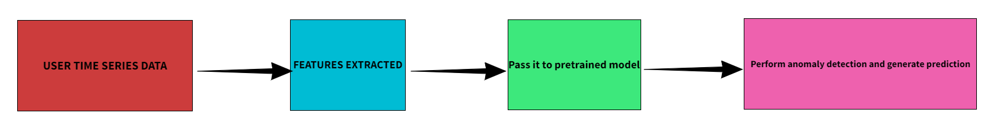

# DATAGENIE HACKATHON

The goal is efficiently find the forecastability score and run an anomaly detection algorithm. 


## Checkpoints
* Train a model to find the forecastability score between 0-10 where 10 being highly forecastable. based on analysis define a threshold below which the time series wouldn't yield results

* Generate predictions: perform batch anomlay detection using Prophet and use window size with 7 batches for each period. Based on granularity adjust this window size

* RESTAPI: setup a RESTAPI application which allows users to prvide any time series data and get prediction. I also used streamlit as my front end application. Calculate forecastability score, MAPE value, number of batch fits and average time taken for each batch fit.

* Model optimization: Optimize the model's per fit training time to reduce the overa;; execution time for entire set of batches. 

## Architecture
### Training Phase


### Test Phase


## My approach
The full doumentation of my work and this hackathon is here in this [link]() and video [demo](https://drive.google.com/drive/folders/1Iv1qMObz5P-rUdyPuuuPVe8InvYRSWOR?usp=drive_link).

## Getting started
Clone this repo in your local machine

### Backend setup
1. Create a virtual environment
```python
cd DG-backend
python3 -m venv venv
```
2. Activate your virtual environment
```python
venv\Scripts\activate
```
3. Install the requirements.txt file
```python
pip install -r requirements.txt
```
4. Run the application
```python
uvicorn main:app --reload
```

### Frontend setup
1. Create a virtual environment
```python
cd DG-frontend
python3 -m venv venv
```
2. Activate your virtual environment
```python
venv\Scripts\activate
```
3. Install the requirements.txt file
```python
pip install -r requirements.txt
```
4. Run the application
```python
streamlit run app.py
```

## Technologies used
* Backend: FastAPI
* Frontend: Streamlit
